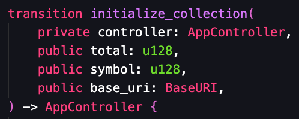

# Account Ownership Overview

The account owner has certain privileges to efficiently manage the account. In the case of a Leo NFT App, there are specific transactions that can only be executed by the owner. These transactions include:

- `initialize_collection`
- `add_nft`
- `add_minter`
- `update_toggle_settings`
- `set_mint_block`
- `update_symbol`
- `update_base_uri`

All of them previously checked against a fixed owner address, which could not be modified:

```
assert_eq(self.caller, aleo1gy3d0s00s2k7rmgqznnx2q8htmjm2p5rk8q40u5yklqhe44utvys0dmzdy);
```

## :recycle: Social Recovery

To incorporate Tyron Social Recovery, you need to include a controller transaction input of type AppController. And the transaction should return a new **sAppController** record that can be used for future ownership verification.


