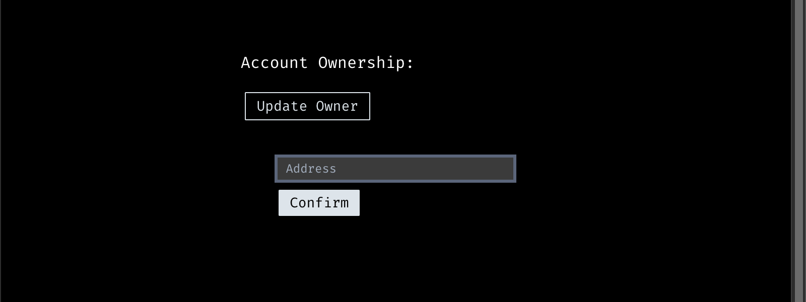

# :bow_and_arrow: Transfer Ownership

The account owner has the option to update or transfer the control of the app to another externally owned account at any time.

By calling the `update_controller` transition, a new owner is established by creating an **AppController** record owned by the new owner.


**Good to know:** When updating the ownership of the account, the social recovery feature is reset, resulting in the removal of all guardians.

