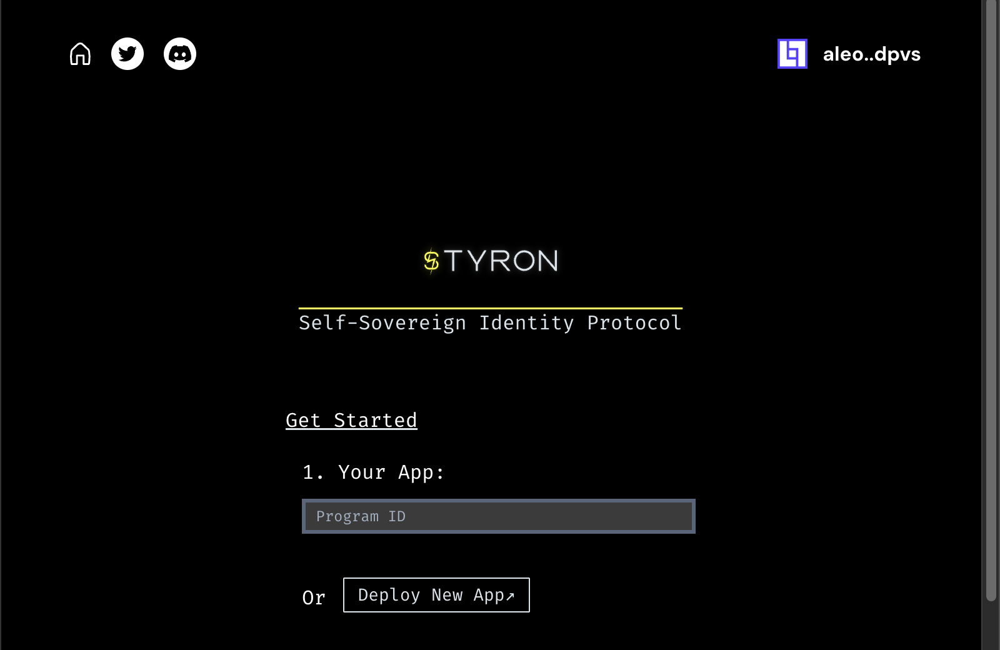

# :satellite: Deploy Program

To create the program, we used the command `npm create aleo-app@latest` to bootstrap an Aleo App. After making the necessary edits to the Leo smart contract, proceed with the deployment process by clicking on “Deploy Program”. This application utilizes the `@aleohq/sdk` and typically takes a few minutes to complete the deployment.

