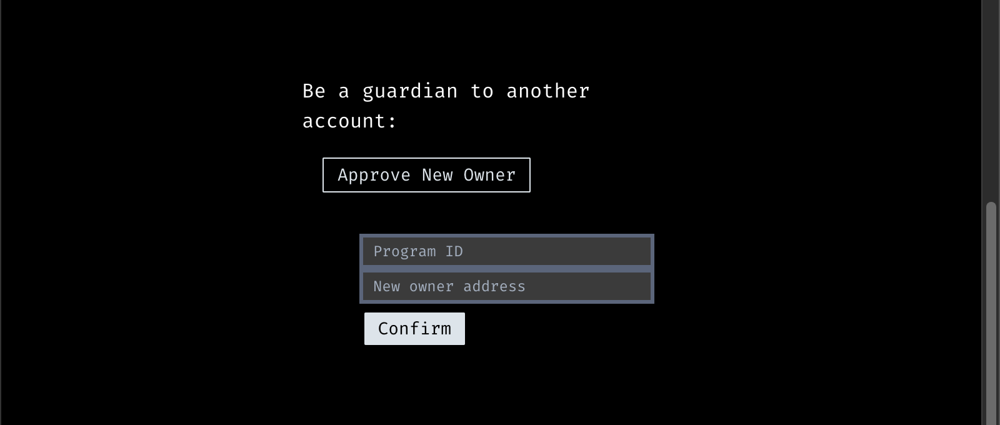

# Be a Guardian

When you are acting as a guardian for another person's account, first make sure to specify the name of the app for which you are the guardian, identified by its program ID.

## :white_check_mark: Approve New Owner

As a guardian, you have the ability to vote and approve a new account owner in cases where the current owner is unable to do so through the regular process.

## :sparkle: Perform the Recovery

Once the necessary number of approvals is reached, the account ownership can be transferred to the new owner.

To do so, a guardian must submit the social recovery transaction.

