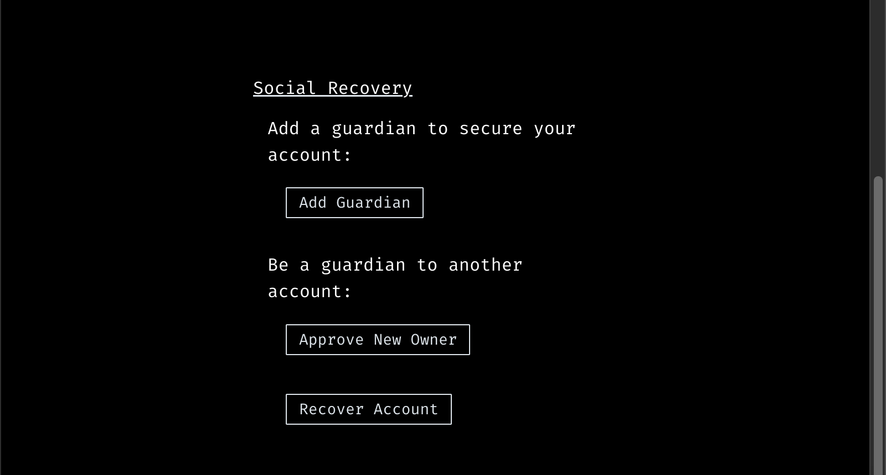

# :recycle: Social Recovery

As explained by Vitalik Buterin:

> Both multisig wallets and social recovery wallets rely on a concept of guardians: a set of N addresses, typically held by other people, of which any M can approve an operation (e.g., one could set N=6 and M=4). In the case of a multisig wallet, each transaction requires the approval of M out of the N guardians. In the case of a social recovery wallet, there is a single key that can sign transactions, but if that key is lost, M out of the N guardians must sign a message to reset the key.


These examples are taken from the excellent [Storybook Example Design System](https://5ccbc373887ca40020446347-geedzbiswp.chromatic.com/?path=/story/icon--labels).


<!-- 
These examples are taken from the excellent [Storybook Example Design System](https://5ccbc373887ca40020446347-geedzbiswp.chromatic.com/?path=/story/icon--labels).
 -->


**Good to know:** Tyron Social Recovery requires an absolute majority (at least half of the guardians plus one) to recover the account.


